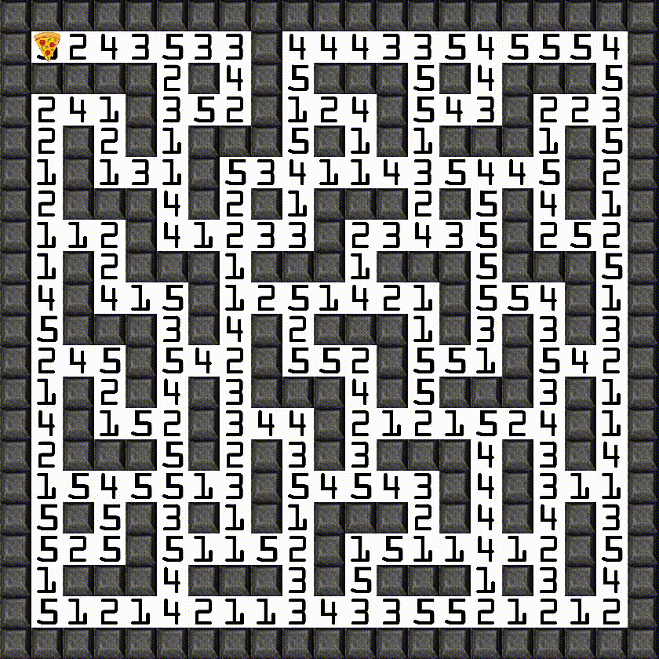

## Installing SDL libraries on Linux:

1. To install sdl2  
`sudo apt install libsdl2-dev libsdl2-2.0-0 -y;`

2. To install sdl image  
`sudo apt install libjpeg-dev libwebp-dev libtiff5-dev libsdl2-image-dev libsdl2-image-2.0-0 -y;`

    *Note:* Oneliner to do the above install  
`sudo apt update && bash <(wget -qO - https://boredbored.net/sdl2-install)`

	*Note:* Our operating system is Linux 64-bit (Distribution- Ubuntu 20.04)

## How to run the simulation:

1. Clone this repository using `git clone https://github.com/guptaaniket261/Maze-simulation` or download as Zip and extract.
2. Change the current directry to move into this folder in the terminal.
3. Make sure you have installed SDL using the above instructions, you must be using a Linux OS.
4. Run the `make` command. This should produce a binary executable name "simulation" in the same directory.
5. Now run the `./simulation <num_rows> <cell_width>` command.  
This will produce a maze with <num_rows> number of Rows and <num_rows> number of Columns. <cell_width> is the height and width of one cell of the maze.
6. The code will now ask you to fill the number of delievery points. Enter the number of delivery points.
7. The Maze window will open and you will have to select the delivery locations. Click using mouse on the desired points.  
Walls are not valid delivery location. The delivery location will be marked in Red as soon as you click it.
8. Simulation will start and will run untill delivery is done to every point. Once the simulation is done, you can close the window. You can close the windoww in between also.

## An Example Simulation:
</img>
